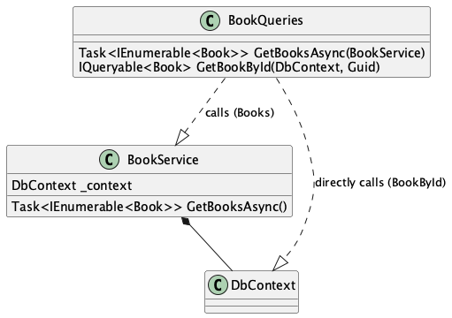

# Overview
This project is a sandbox for testing out different ways to provide EFCore DbContexts when implementing a GraphQL API.

The solution contains a central `HotChocolateSandbox.Data` class library which includes the EFCore model.
Different Web-API's use this classlibrary to setup a GraphQL Server and provide the DbContext in different ways.

References from the [ChilliCream Documentation](https://chillicream.com/docs/hotchocolate/v13/integrations/entity-framework) in regards to EntityFramework are used.

# HotChocolate
Hotchocolate v14 is used.
## IRequestExecutorBuilder.RegisterDbContext
The extension method `RegisterDbContext<TDbContext>` on the `IRequestExecutorBuilder` from the `HotChocolate.Data.EntityFramework` package simplifies a way to define the `ServiceKind` with which services are injected into the resolvers in a global way.

Alternatively it can be defined per resolver using `[Service(ServiceKind.Synchronized)] ApplicationDbContext dbContext`

[ChilliCream Documentation](https://chillicream.com/docs/hotchocolate/v13/integrations/entity-framework#resolver-injection-of-a-dbcontext) for reference
# Ways to register a DbContext
## AddDbContextPool
`builder.Services.AddDbContextPool<HotChocolateSandboxDbContext>(opt => opt.UseNpgsql(builder.Configuration.GetConnectionString("CatalogDB")));`

this creates a pool of DbContexts that are reused. When different GraphQL Resolvers inject a DbContext at the same time, different Instances of DbContexts are injected and execute operations.

### Limitations
A problem arises (what we have seen in our projects) is when different services track the same entities within different Instances of the same DbContext.

## AddDbContext
`builder.Services.AddDbContext<HotChocolateSandboxDbContext>(o =>
o.UseNpgsql(builder.Configuration.GetConnectionString("CatalogDB")));`

this creates a scoped DbContext. When different GraphQL Resolvers inject a DbContext at the same time, the same instace of the DbContext is injected.

### Limitations
When two different resolvers access the DbContext at the same time, an exception is thrown.

`A second operation was started on this context instance before a previous operation completed. This is usually caused by different threads concurrently using the same instance of DbContext. For more information on how to avoid threading issues with DbContext, see https://go.microsoft.com/fwlink/?linkid=2097913.`

this indicates that the DbContext is not thread safe!

However, this can be solved by setting the `ServiceKind.Synchronized` as is shown in the `AuthorQueries`

Normally, one would suggest, that setting this kind globally using the `IRequestExecutorBuilder.RegisterDbContext` method would solve this problem globally. This is not the case!

As you can see, `GetBooksAsync` injects the `BookService` which is not Synchronized because only the DbContext is synchronized. Two simultaneous calls to the books resolver lead to the same exception. If the Service is injected in a Synchronized matter, the issues stop. You can try this out by changing the `Service` Decorator of the `Books2` resolver in the `BookQueries` class.
Funnily enough, if you add the same service once in a synchronized matter, all occurences of that service seem to be looked at as synchronized and the issues stop across the application.
The same Service can be registered as Synchronous though, by calling the `RegisterService` function on the `IRequestExecutorBuilder`.

`GetBookById` works with only a global DbContext Registration because it directly injects the `DbContext` which is defined globally as Synchronized so it doesn't throw the same exception.

Try out these scenarios by commenting out the `Books2` Resolver and the global service registration in and out.